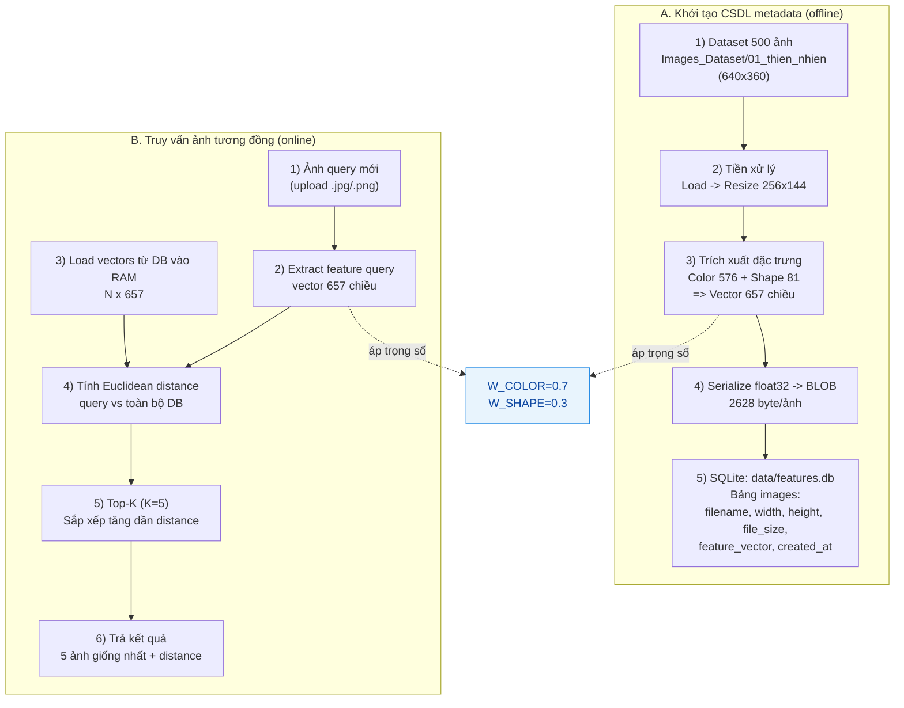

# Mô tả cách hoạt động hệ thống CBIR

Tài liệu này mô tả ngắn gọn 2 luồng chính của hệ thống:
1. Luồng **khởi tạo CSDL** để lưu metadata ảnh.
2. Luồng **truy vấn ảnh mới** để trả ra **5 ảnh giống nhất**.

## Hình minh hoạ tổng quan

> Gợi ý: nếu IDE không render Mermaid, bạn có thể copy block này sang GitHub Markdown hoặc Mermaid Live Editor để xuất ảnh PNG/SVG.

## 1) Luồng khởi tạo CSDL metadata (offline)

Luồng này chạy qua script `build_database.py`:

1. Đọc toàn bộ ảnh `.jpg` trong `Images_Dataset/01_thien_nhien`.
2. Với từng ảnh:
   - Đọc metadata file: `width`, `height`, `file_size`.
   - Trích xuất vector đặc trưng 657 chiều:
     - `576` chiều màu (color histogram theo lưới 3x3).
     - `81` chiều hình dạng (gradient histogram theo lưới 3x3).
   - Nhân trọng số: `0.7` cho color, `0.3` cho shape.
   - Chuyển vector `np.float32` sang bytes (`BLOB`) bằng `tobytes()`.
3. Ghi vào SQLite `data/features.db`, bảng `images` (upsert theo `filename`).

Mục tiêu của bước này là chuẩn bị sẵn metadata để khi query không cần tính lại cho toàn bộ 500 ảnh.

## 2) Luồng truy vấn ảnh mới và trả về top-5

Luồng này dùng trong `query_cli.py` và `ui/app.py`:

1. Nhận ảnh truy vấn mới từ người dùng.
2. Trích xuất vector 657 chiều cho ảnh truy vấn bằng cùng pipeline đã dùng khi build DB.
3. Nạp các vector đã lưu trong DB vào RAM (`N x 657`).
4. Tính khoảng cách Euclidean từ vector query đến tất cả vector trong DB.
5. Sắp xếp tăng dần theo khoảng cách và lấy `Top-K`, mặc định `K=5`.
6. Trả về 5 ảnh gần nhất cùng giá trị distance.

## 3) Metadata ảnh đang được lưu gồm gì?

Trong bảng `images`:
- `filename`: tên file ảnh (duy nhất).
- `width`, `height`: kích thước ảnh gốc.
- `file_size`: dung lượng file ảnh.
- `feature_vector`: vector nội dung ảnh ở dạng `BLOB` (657 số float32).
- `created_at`: thời điểm ghi dữ liệu.

Nói ngắn gọn:
- Metadata kỹ thuật file: `filename`, `width`, `height`, `file_size`.
- Metadata nội dung ảnh: `feature_vector`.

## 4) Liên hệ với yêu cầu đề bài

Theo `docs/require.md`, hệ thống cần:
- Xây CSDL lưu siêu dữ liệu ảnh.
- Tìm ảnh tương đồng từ một ảnh mới, trả ra 5 ảnh giống nhất.

Thiết kế hiện tại đáp ứng trực tiếp:
- CSDL: SQLite `data/features.db`.
- Siêu dữ liệu: metadata file + vector đặc trưng nội dung.
- Tìm kiếm: Euclidean distance + top-5.
